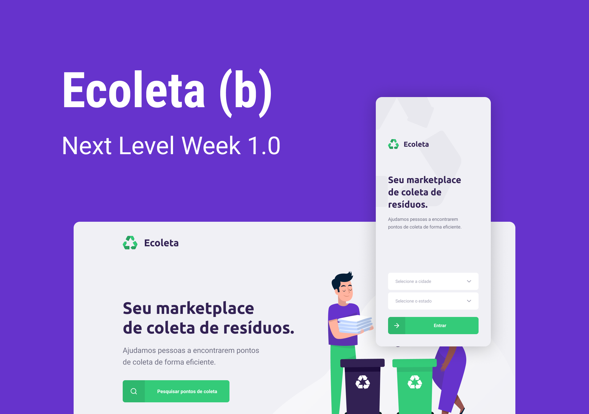

<h1 align="center">
 
</h1>


<p align="center">
  

  

  
  <a href="https://github.com/luizcasula/ecoleta-nlw/commits/master">
    
  </a>

  
</p>

<p align="center">
  <a href="#rocket-tecnologias">Tecnologias</a>&nbsp;&nbsp;&nbsp;|&nbsp;&nbsp;&nbsp;
  <a href="#hammer-como-usar">Como Usar</a>&nbsp;&nbsp;&nbsp;|&nbsp;&nbsp;&nbsp;
  <a href="#page_with_curl-licença">Licença</a>
</p>

<br>

<br>
<br>


# :rocket: Tecnologias

-  [Express](https://expressjs.com/)
-  [Knex](http://knexjs.org/)
-  [sqlite3](https://www.sqlite.org/index.html)
-  [Multer](https://github.com/expressjs/multer)
-  [Cors](https://www.npmjs.com/package/cors)
-  [Celebrate](https://github.com/arb/celebrate)
-  [Axios](https://github.com/axios/axios)
-  [Leaflet](https://leafletjs.com/index.html)
-  [React Dropzone](https://react-dropzone.js.org/)
-  [React Navigation](https://reactnavigation.org/)
-  [React-Native](https://facebook.github.io/react-native/)
-  [Expo](https://expo.io/)
-  [Expo Location](https://docs.expo.io/versions/latest/sdk/location/)
-  [Expo Mail Composer](https://docs.expo.io/versions/latest/sdk/mail-composer/)


# :hammer: Como usar

```bash
# Clone o repositório
$ git clone https://github.com/luizcasula/ecoleta-nlw
```

## :computer: Front-end

```bash
# Navegue até a pasta web
$ cd web

# Inicialize a página
$ npm start
```
## :gear: Back-end

```bash
# Navegue até a pasta server
$ cd server

# Inicialize o banco de dados
$ npx knex migrate:latest —knexfile knexfile.ts migrate:latest

# Inicialize o servidor
$ yarn dev
```

## :iphone: Mobile

```bash
# Navegue até a pasta mobile
$ cd mobile

# Inicialize o aplicativo
$ expo start
```

# :handshake: Como contribuir


# :page_with_curl: Licença
Esse projeto está sobre a lincença MIT. Veja o arquivo [LICENSE](https://github.com/luizcasula/ecoleta-nlw/blob/master/LICENSE) para mais informações.
